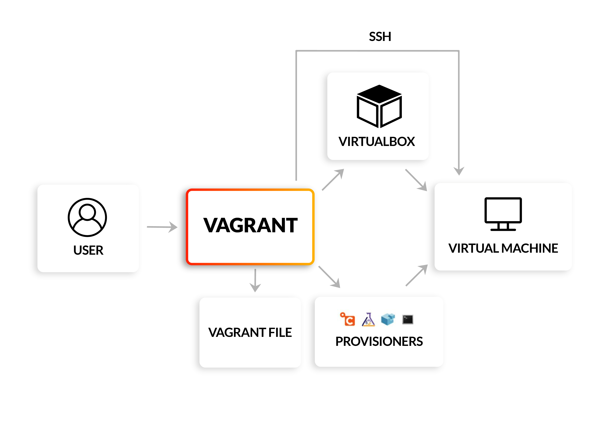
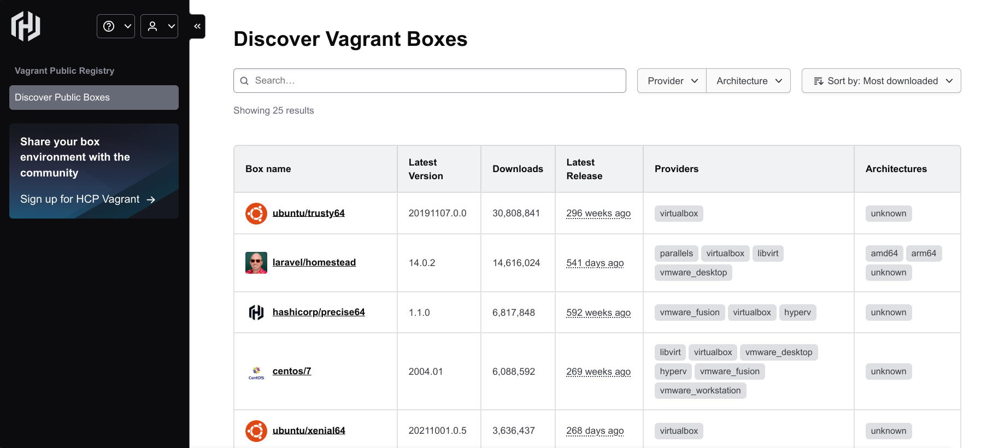
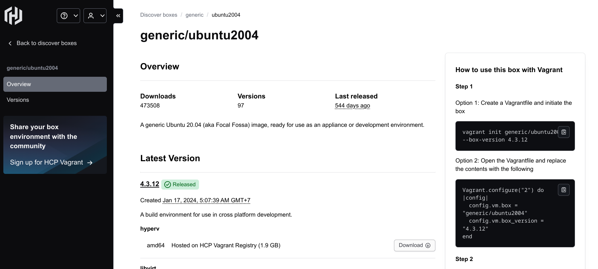
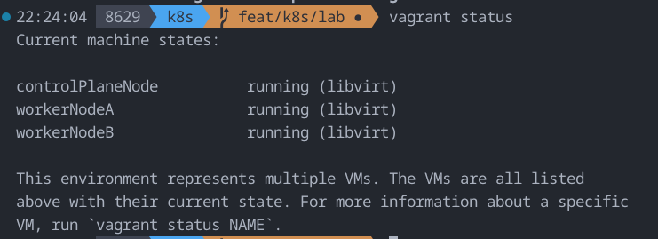

**Spam VM cực nhanh với Vagrant - Provisioning Tools cực hay**



Bạn xài Windows muốn dựng VM Linux để làm việc? Bạn xài Linux muốn spam một nùi con VM server để chạy chọt thử chọc phá tools này tools kia?
Bạn tự nhiên hứng lên muốn làm lab này lab nọ? Nhưng không có server để chạy?

Mà bây giờ phải bật con VMware Workstation, KVM, VirtualBox,... lên, config mạng mẽo, cài utilities, cài tools, cài các package cần thiết cho từng con ... ai rảnh :v

Nếu bạn còn đọc tới dòng tôi đang viết này thì chúc mừng, đúng người rồi, hãy dùng Vagrant ngay nhé.


### Giới thiệu



Vagrant là một Provisioning Tools cực hay, nó giúp bạn dựng VM nhanh chóng, tự động hóa việc cài đặt các package, tools cần thiết cho từng con VM mà bạn muốn.
Vagrant còn hỗ trợ rất nhiều provider như VirtualBox, VMware, KVM, Hyper-V,...

Như đã nói thì Vagrant là một Provisioning Tools, tức là nếu mọi người đã từng dùng các Provisioning Tools khác như Ansible, Chef, Puppet,... thì sẽ thấy Vagrant cũng có những tính năng tương tự.

Nếu bạn chưa dùng các tools này thì: Nói một cách đơn giản, Vagrant là một công cụ tạo và quản lý môi trường máy ảo một cách tự động và lặp lại. Thay vì phải click chuột lia lịa để tạo từng VM, cấu hình RAM, CPU, card mạng... bạn chỉ cần định nghĩa tất cả trong một file duy nhất tên là Vagrantfile.

Với Vagrant, ta có thể:

- Tạo VM hàng loạt, ví dụ cần 3 server Ubuntu, 1 server CentOS? Chỉ cần vài dòng lệnh là xong.

- Đảm bảo tính nhất quán => Môi trường trên máy bạn và đồng nghiệp sẽ giống hệt nhau, không còn câu chuyện muôn thuở "Ơ, máy tao chạy mà máy mày không chạy vậy mày??".

- Dễ dàng chia sẻ => Chỉ cần chia sẻ file Vagrantfile, ai cũng có thể tạo lại môi trường y hệt. Thằng bạn hỏi mày setup môi trường sao thế? Đơn giản, vứt nó nguyên cục file Vagrantfile, nó chỉ cần chạy `vagrant up` là xong.

- Tích hợp với nhiều Provider khác nhau như VirtualBox, VMware, Hyper-V và đặc biệt là KVM (Kernel-based Virtual Machine) - một lựa chọn tuyệt vời cho người dùng Linux (I use Debian btw).

### Cài đặt thế nào? Vào việc

Để bắt đầu, ta cần cài đặt 2 thứ:

- Trình ảo hóa (Provider): Trong bài này, mình sẽ dùng KVM vì nó nhẹ, nhanh và được tích hợp sẵn trong nhân Linux (I use Debian btw). Nếu bạn dùng Windows hay macOS, VirtualBox là lựa chọn phổ biến và dễ cài đặt nhất.

- Vagrant: Tải và cài đặt từ trang chủ của Vagrant.

(Để cài KVM trên Ubuntu hoặc các distro tương tự, bạn có thể chạy lệnh: sudo apt install qemu-kvm libvirt-daemon-system libvirt-clients bridge-utils virt-manager)

Sau khi cài đặt xong, hãy kiểm tra lại bằng lệnh vagrant --version

### Thực hành: Dựng một lab K8S với 3 máy ảo Ubuntu
Giả sử chúng ta cần một lab gồm 3 máy chủ Ubuntu (1 master, 2 worker) để nghịch Kubernetes chẳng hạn.

#### Bước 1: Tìm Box Phù Hợp



Vagrant sử dụng các "image" được đóng gói sẵn, hay còn gọi là Box. Cái này giống như kiểu là các template máy ảo. Bạn hãy lên trang này để lựa Box mà muốn xài: [Vagrant Cloud](https://portal.cloud.hashicorp.com/vagrant/discover).

Ở đây, bạn có thể tìm thấy vô số box cho các hệ điều hành khác nhau (Ubuntu, CentOS, Debian,...) và cho các provider khác nhau (KVM, VirtualBox,...).

Trong ví dụ này, chúng ta sẽ sử dụng box generic/ubuntu2004:



Mấy bạn nhìn bên góc tay phải sẽ có hướng dẫn dùng luôn nha, ở đây ta lưu ý một lát nữa sẽ dùng lệnh trong option 2 nha:

```Vagrantfile
Vagrant.configure("2") do |config|
  config.vm.box = "generic/ubuntu2004"
  config.vm.box_version = "4.3.12"
end
```

#### Bước 2: Tạo Vagrantfile

Tạo folder chứa project nhé:

```bash
mkdir k8s-lab
cd k8s-lab
```

Bây giờ, hãy tạo một file tên là Vagrantfile (viết hoa chữ V, không có đuôi file) với nội dung sau:

```ruby
Vagrant.configure(2) do |k8s_lab|                 # khai báo máy ảo

  k8s_lab.vm.define "controlPlaneNode" do |controlPlaneNode|
    controlPlaneNode.vm.provider "libvirt" do |libvirt|        # Máy ảo dùng libvirt và cấu hình tài nguyên
      libvirt.cpus = 2                                 # cấp 2 core CPU
      libvirt.memory = "2096"                          # cấp 2GB bộ nhớ
    end                                            # kết thúc cấu hình tài nguyên 

    controlPlaneNode.vm.box = 'generic/ubuntu2004'              # Sử dụng Box generic/ubuntu2004 tạo máy ảo được lấy từ vagrant cloud
    controlPlaneNode.vm.network "private_network", ip: "192.168.122.22"
    controlPlaneNode.vm.hostname = "controlPlaneNode"

  end

  k8s_lab.vm.define "workerNodeA" do |workerNodeA|
    workerNodeA.vm.provider "libvirt" do |libvirt|
      libvirt.cpus = 2
      libvirt.memory = "2096"
    end

    workerNodeA.vm.box = 'generic/ubuntu2004'
    workerNodeA.vm.network "private_network", ip: "192.168.122.23"
    workerNodeA.vm.hostname = "workerNodeA"

  end

  k8s_lab.vm.define "workerNodeB" do |workerNodeB|
    workerNodeB.vm.provider "libvirt" do |libvirt|
      libvirt.cpus = 2
      libvirt.memory = "2096"
    end

    workerNodeB.vm.box = 'generic/ubuntu2004'
    workerNodeB.vm.network "private_network", ip: "192.168.122.24"
    workerNodeB.vm.hostname = "workerNodeB"

  end
  
  k8s_lab.vm.provision "shell", inline: <<-SHELL    

    # Set root password and allow ssh login
    echo "root:password" | chpasswd
    sed -i 's/#PermitRootLogin prohibit-password/PermitRootLogin yes/' /etc/ssh/sshd_config
    systemctl reload sshd

    # Install nginx
    sudo apt-get update
    sudo apt-get install -y nginx
    sudo systemctl enable nginx
    sudo systemctl start nginx

    cat <<EOF | sudo tee /etc/modules-load.d/containerd.conf
    overlay
    br_netfilter
EOF

    sudo modprobe overlay
    sudo modprobe br_netfilter

    # Config sysctl cho networking
    cat <<EOF | sudo tee /etc/sysctl.d/99-kubernetes-cri.conf
    net.bridge.bridge-nf-call-iptables  = 1
    net.ipv4.ip_forward                 = 1
    net.bridge.bridge-nf-call-ip6tables = 1
EOF

    sudo sysctl --system

    # Install containerd
    sudo apt-get install containerd -y
    sudo mkdir -p /etc/containerd
    sudo containerd config default | sudo tee /etc/containerd/config.toml

    sudo sed -i 's/SystemdCgroup = false/SystemdCgroup = true/g' /etc/containerd/config.toml

    # Khởi động lại và bật containerd
    sudo systemctl restart containerd
    sudo systemctl enable containerd

    sudo swapoff -a
    sudo sed -i '/ swap / s/^\(.*\)$/#\1/g' /etc/fstab

    # Install K8S dependencies
    sudo apt-get install -y apt-transport-https ca-certificates curl gpg

    sudo mkdir -p -m 755 /etc/apt/keyrings

    # Add google GPG key
    curl -fsSL https://pkgs.k8s.io/core:/stable:/v1.33/deb/Release.key | sudo gpg --dearmor -o /etc/apt/keyrings/kubernetes-apt-keyring.gpg

    # Add Kubernetes repository
    echo 'deb [signed-by=/etc/apt/keyrings/kubernetes-apt-keyring.gpg] https://pkgs.k8s.io/core:/stable:/v1.33/deb/ /' | sudo tee /etc/apt/sources.list.d/kubernetes.list

    # Install K8s tools
    sudo apt-get update
    sudo apt-get install -y kubelet kubeadm kubectl
    sudo apt-mark hold kubelet kubeadm kubectl

  SHELL

end
```

Giải thích xíu:

```ruby
Vagrant.configure(2) do |k8s_lab|                 # khai báo máy ảo

  k8s_lab.vm.define "controlPlaneNode" do |controlPlaneNode|
    controlPlaneNode.vm.provider "libvirt" do |libvirt|        # Máy ảo dùng libvirt và cấu hình tài nguyên
      libvirt.cpus = 2                                 # cấp 2 core CPU
      libvirt.memory = "2096"                          # cấp 2GB bộ nhớ
    end                                            # kết thúc cấu hình tài nguyên 

    controlPlaneNode.vm.box = 'generic/ubuntu2004'              # Sử dụng Box generic/ubuntu2004 tạo máy ảo được lấy từ vagrant cloud
    controlPlaneNode.vm.network "private_network", ip: "192.168.122.22"
    controlPlaneNode.vm.hostname = "controlPlaneNode"

  end

  k8s_lab.vm.define "workerNodeA" do |workerNodeA|
    workerNodeA.vm.provider "libvirt" do |libvirt|
      libvirt.cpus = 2
      libvirt.memory = "2096"
    end

    workerNodeA.vm.box = 'generic/ubuntu2004'
    workerNodeA.vm.network "private_network", ip: "192.168.122.23"
    workerNodeA.vm.hostname = "workerNodeA"

  end

  k8s_lab.vm.define "workerNodeB" do |workerNodeB|
    workerNodeB.vm.provider "libvirt" do |libvirt|
      libvirt.cpus = 2
      libvirt.memory = "2096"
    end

    workerNodeB.vm.box = 'generic/ubuntu2004'
    workerNodeB.vm.network "private_network", ip: "192.168.122.24"
    workerNodeB.vm.hostname = "workerNodeB"

  end
```

Phần ở trển là để khai báo và cấu hình ví dụ RAM, CPU, hostname, network,... cho các VM mà ta muốn tạo => Yahh đỡ phải config tay bấm bấm, ssh vào từng con server như trước nữa nhé

```ruby
  k8s_lab.vm.provision "shell", inline: <<-SHELL    
```

Cục này thì sẽ ra lệnh cho Vagrant tự động chạy các script mà mình muốn trên tất cả các máy ảo ngay sau khi chúng được tạo xong. Có thể tận dụng cục này để cài Docker, Nginx, Containerd, K8S,... bất cứ thứ gì mình muốn, đỡ phải SSH vào từng con server để cài đặt nữa.

```ruby
    # Set root password and allow ssh login
    echo "root:password" | chpasswd
    sed -i 's/#PermitRootLogin prohibit-password/PermitRootLogin yes/' /etc/ssh/sshd_config
    systemctl reload sshd

    # Install nginx
    sudo apt-get update
    sudo apt-get install -y nginx
    sudo systemctl enable nginx
    sudo systemctl start nginx

    cat <<EOF | sudo tee /etc/modules-load.d/containerd.conf
    overlay
    br_netfilter
EOF

    sudo modprobe overlay
    sudo modprobe br_netfilter

    # Config sysctl cho networking
    cat <<EOF | sudo tee /etc/sysctl.d/99-kubernetes-cri.conf
    net.bridge.bridge-nf-call-iptables  = 1
    net.ipv4.ip_forward                 = 1
    net.bridge.bridge-nf-call-ip6tables = 1
EOF

    sudo sysctl --system

    # Install containerd
    sudo apt-get install containerd -y
    sudo mkdir -p /etc/containerd
    sudo containerd config default | sudo tee /etc/containerd/config.toml

    sudo sed -i 's/SystemdCgroup = false/SystemdCgroup = true/g' /etc/containerd/config.toml

    # Khởi động lại và bật containerd
    sudo systemctl restart containerd
    sudo systemctl enable containerd

    sudo swapoff -a
    sudo sed -i '/ swap / s/^\(.*\)$/#\1/g' /etc/fstab

    # Install K8S dependencies
    sudo apt-get install -y apt-transport-https ca-certificates curl gpg

    sudo mkdir -p -m 755 /etc/apt/keyrings

    # Add google GPG key
    curl -fsSL https://pkgs.k8s.io/core:/stable:/v1.33/deb/Release.key | sudo gpg --dearmor -o /etc/apt/keyrings/kubernetes-apt-keyring.gpg

    # Add Kubernetes repository
    echo 'deb [signed-by=/etc/apt/keyrings/kubernetes-apt-keyring.gpg] https://pkgs.k8s.io/core:/stable:/v1.33/deb/ /' | sudo tee /etc/apt/sources.list.d/kubernetes.list

    # Install K8s tools
    sudo apt-get update
    sudo apt-get install -y kubelet kubeadm kubectl
    sudo apt-mark hold kubelet kubeadm kubectl

  SHELL
```

Như ở trên là các cài đặt cơ bản để dựng K8S lab thôi. Sắp tới mình sẽ làm series K8S, lúc đó ta lại quay lại cái này nhé.

#### Bước 3: Chạy Vagrant

Câu lệnh khoái nhất khi làm DevOps: UP UP UP!!!

```bash
vagrant up
```

Bạn chỉ cần quăng lệnh đó vào terminal, và đi pha cà phê cho mình, tí quay lại, vì Vagrant nó sẽ tự làm tất cả mọi thứ còn lại rồi.

Sau khi lệnh chạy xong, gõ:

```bash
vagrant status
```

Bạn sẽ thấy cả 3 node đều đang running:



### Kết 
Vậy là xong ha, giờ bạn đã có một lab K8S với 3 máy ảo Ubuntu sẵn sàng để nghịch phá rồi. 

Ngoài ra Vagrant còn làm được nhiều trò hay ho nữa:

- Tạo snapshot cho VM
- Chia sẻ thư mục giữa host và guest
- Cài đặt phần mềm tự động
- Quản lý nhiều môi trường phát triển khác nhau
- Tích hợp với các công cụ CI/CD

Vân vân và vân vân...

Doc của nhà Hashicorp đọc dễ hiểu lắm, bạn có thể đọc thêm để master cái này nhé: [Vagrant Documentation](https://www.vagrantup.com/docs)