## I. So performance

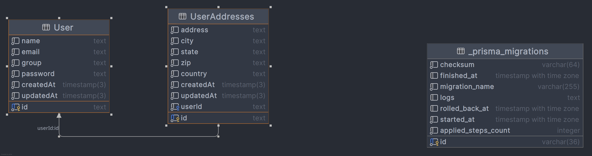

Bài test sẽ thực hiện trên 2 bảng User và UserAddress
Mỗi một user sẽ có nhiều address khác nhau

- Benchmark tạo nhiều người dùng (createManyUsers): chưa có thông tin địa chỉ
- Benchmark tìm kiếm tất cả người dùng (findUsers): tìm ra tất cả người dùng có join để kèm thông tin tất cả địa chỉ của người đó
- Benchmark tìm kiếm người dùng theo nhóm (findByGroup): không join, nhưng sẽ dùng where để tìm user thuộc một group nào đó
- Benchmark tạo người dùng với thông tin chi tiết (createUsersIntensive): tạo users nhưng sẽ có thêm địa chỉ
  Bài test 100 users: tức là sẽ tạo ra 100 users không có địa chỉ, 100 users có địa chỉ, mỗi user sở hữu 100 địa chỉ => tổng cộng 10 000 địa chỉ

- Prisma

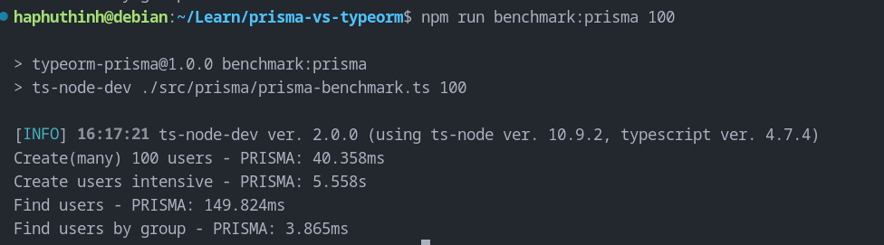

- Typeorm

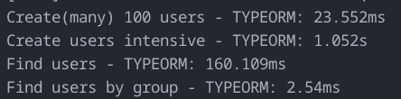

- Sequelize-typescript:

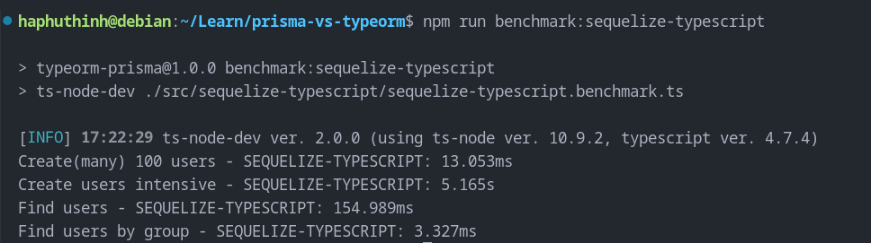

|           | Create(many) | Create(with address) | Find all users (join address) | Find users by group |
| --------- | ------------ | -------------------- | ----------------------------- | ------------------- |
| Prisma    | 40.358 ms    | 5558 ms              | 142.824ms                     | 3.865 ms            |
| Sequelize | 13.053 ms    | 5165 ms              | 154.989ms                     | 3.327ms             |
| TypeORM   | 23.552ms     | 1052ms               | 160.109ms                     | 2.54ms              |

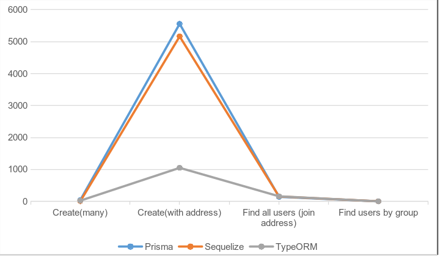

Bài test 300 users

- Prisma

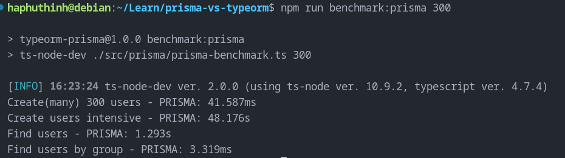

- TypeORM

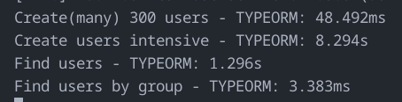

- Sequelize-typescript

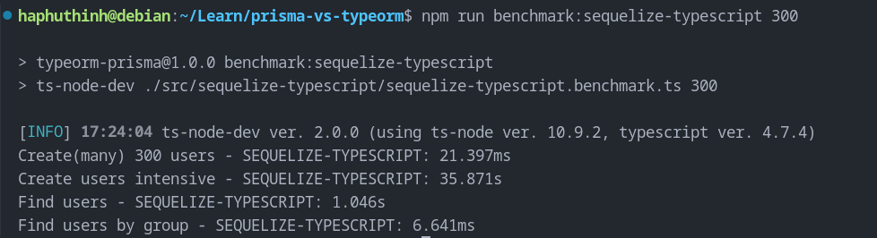

|           | Create(many) | Create(with address) | Find all users (join address) | Find users by group |
| --------- | ------------ | -------------------- | ----------------------------- | ------------------- |
| Prisma    | 41.587ms     | 48176ms              | 1293ms                        | 3.319ms             |
| Sequelize | 21.397ms     | 35871ms              | 1046ms                        | 6.641ms             |
| TypeORM   | 48.492ms     | 8294ms               | 1296ms                        | 3.383ms             |

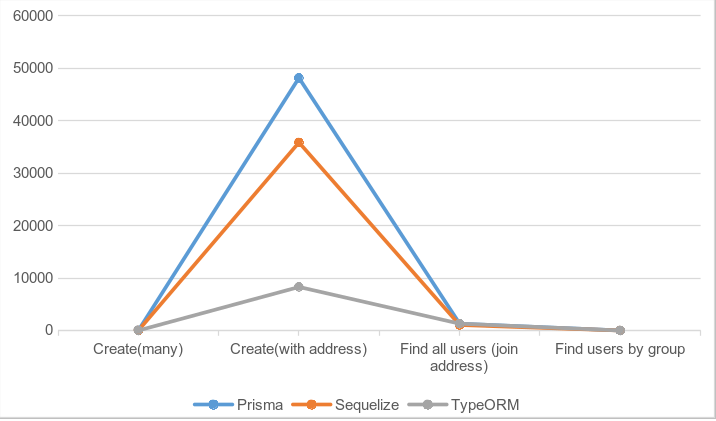

Bài test 500 users, tức 1000 record users, 250 000 record useraddress

- Prisma

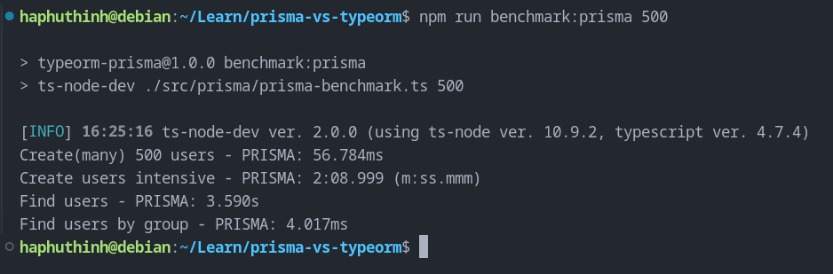

- TypeORM:

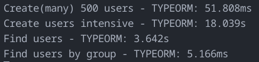

- Sequelize-typescript

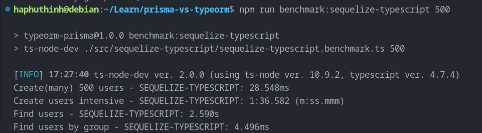

|           | Create(many) | Create(with address) | Find all users (join address) | Find users by group |
| --------- | ------------ | -------------------- | ----------------------------- | ------------------- |
| Prisma    | 56.784ms     | 128999ms             | 3590ms                        | 4.017ms             |
| Sequelize | 23.548ms     | 96582ms              | 2590ms                        | 4.496ms             |
| TypeORM   | 51.808ms     | 18039ms              | 3642ms                        | 5.166ms             |

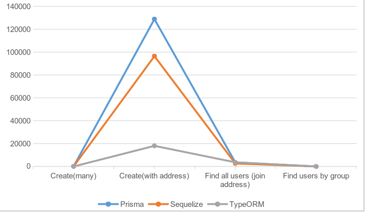

Qua kết quả ta có thể thấy sắp xếp theo performance từ tốt tới dở sẽ như sau:

1. TypeORM
2. Sequelize-typescript
3. Prisma

Vậy câu hỏi đặt ra là Prisma nó làm gì mà chậm dữ vậy? Nhất là với bài benchmark createIntensiveUser
Câu trả lời sau khi log câu query mà prisma tạo, nó là như thế này:

- Câu query của Sequelize:

```sql
  INSERT INTO "User" ("id","name","email","group","password") VALUES ($1,$2,$3,$4,$5) RETURNING "id","name","email","group","password";
  INSERT INTO "UserAddresses" ("id","address","city","state","country","zip","userId") VALUES ($1,$2,$3,$4,$5,$6,$7) RETURNING "id","address","city","state","country","zip","userId";
```

- Câu query của TypeORM:

```sql
  START TRANSACTION
  INSERT INTO "User"("id", "name", "email", "group", "password", "createdAt", "updatedAt") VALUES (DEFAULT, $1, $2, $3, $4, DEFAULT, DEFAULT) RETURNING "id", "createdAt", "updatedAt" -- PARAMETERS: ["Freddie Labadie I","Alexandrine.Ruecker70@hotmail.com","superadmin","zxJaKM93QU3iAK2"]
  INSERT INTO "UserAddresses"("id", "address", "city", "state", "country", "zip", "createdAt", "updatedAt", "userId") VALUES (DEFAULT, $1, $2, $3, $4, $5, DEFAULT, DEFAULT, $6) RETURNING "id", "createdAt", "updatedAt" -- PARAMETERS: ["110 Lemke Expressway","Henrifield","Illinois","South Georgia and the South Sandwich Islands","29201","8ce857ce-da33-4fa9-9efd-4041e477b5fd"]
  COMMIT
```

- Câu query của Prisma:

```sql
  BEGIN
  INSERT INTO "public"."User" ("id","name","email","group","password","createdAt","updatedAt") VALUES ($1,$2,$3,$4,$5,$6,$7) RETURNING "public"."User"."id"
  INSERT INTO "public"."UserAddresses" ("id","address","city","state","zip","country","createdAt","updatedAt","userId") VALUES ($1,$2,$3,$4,$5,$6,$7,$8,$9) RETURNING "public"."UserAddresses"."id"
  SELECT "public"."User"."id", "public"."User"."name", "public"."User"."email", "public"."User"."group", "public"."User"."password", "public"."User"."createdAt", "public"."User"."updatedAt" FROM "public"."User" WHERE "public"."User"."id" = $1 LIMIT $2 OFFSET $3
  query COMMIT
```

Có thể thấy, Prisma bị thừa bước so với 2 thằng còn lại ở chỗ nó sẽ thực hiện select lại TOÀN BỘ những gì vừa được insert vào sau khi thực hiện xong việc insert => làm giảm performance do chỉ thực hiện insert mà còn thừa ra bước select chả biết để làm gì
Không chỉ có thế, các câu query mà yêu cầu join bảng, cụ thể là bài test findUsers của prisma cũng có vấn đề

- Query của TypeORM:

```sql
  SELECT "UserModel"."id" AS "UserModel_id", "UserModel"."name" AS "UserModel_name", "UserModel"."email" AS "UserModel_email", "UserModel"."group" AS "UserModel_group", "UserModel"."password" AS "UserModel_password", "UserModel"."createdAt" AS "UserModel_createdAt", "UserModel"."updatedAt" AS "UserModel_updatedAt", "UserModel**UserModel_userAddresses"."id" AS "UserModel**UserModel_userAddresses_id", "UserModel**UserModel_userAddresses"."address" AS "UserModel**UserModel_userAddresses_address", "UserModel**UserModel_userAddresses"."city" AS "UserModel**UserModel_userAddresses_city", "UserModel**UserModel_userAddresses"."state" AS "UserModel**UserModel_userAddresses_state", "UserModel**UserModel_userAddresses"."country" AS "UserModel**UserModel_userAddresses_country", "UserModel**UserModel_userAddresses"."zip" AS "UserModel**UserModel_userAddresses_zip", "UserModel**UserModel_userAddresses"."createdAt" AS "UserModel**UserModel_userAddresses_createdAt", "UserModel**UserModel_userAddresses"."updatedAt" AS "UserModel**UserModel_userAddresses_updatedAt", "UserModel**UserModel_userAddresses"."userId" AS "UserModel**UserModel_userAddresses_userId" FROM "User" "UserModel" LEFT JOIN "UserAddresses" "UserModel**UserModel_userAddresses" ON "UserModel**UserModel_userAddresses"."userId"="UserModel"."id"
```

- Query của Sequelize:

```sql
  SELECT "UserModel"."id", "UserModel"."name", "UserModel"."email", "UserModel"."group", "UserModel"."password", "userAddresses"."id" AS "userAddresses.id", "userAddresses"."address" AS "userAddresses.address", "userAddresses"."city" AS "userAddresses.city", "userAddresses"."state" AS "userAddresses.state", "userAddresses"."country" AS "userAddresses.country", "userAddresses"."zip" AS "userAddresses.zip", "userAddresses"."userId" AS "userAddresses.userId" FROM "User" AS "UserModel" LEFT OUTER JOIN "UserAddresses" AS "userAddresses" ON "UserModel"."id" = "userAddresses"."userId";
```

- Và query của khứa Prisma:

```sql
  SELECT "public"."User"."id", "public"."User"."name", "public"."User"."email", "public"."User"."group", "public"."User"."password", "public"."User"."createdAt", "public"."User"."updatedAt" FROM "public"."User" WHERE 1=1 OFFSET $1
  SELECT "public"."UserAddresses"."id", "public"."UserAddresses"."address", "public"."UserAddresses"."city", "public"."UserAddresses"."state", "public"."UserAddresses"."zip", "public"."UserAddresses"."country", "public"."UserAddresses"."createdAt", "public"."UserAddresses"."updatedAt", "public"."UserAddresses"."userId" FROM "public"."UserAddresses" WHERE "public"."UserAddresses"."userId" IN ($1,$2) OFFSET $3
```

Bạn thấy điều gì chứ, đúng ra lẽ thường sẽ như Sequelize hoặc TypeORM sẽ sử dụng JOIN và viết trong một câu SELECT duy nhất, thì Prisma chọn cách ảo ma hơn đó là nó nói không với JOIN, và thực hiện nước đi đó là tách thành 2 câu SELECT khác nhau, rồi nó sẽ thực hiện mapping dưới code như nào đó chỉ mình nó biết => giảm performance.

## II. Coding experience

### 1. Tương thích với Typescript

- Bản chất Sequelize v6 (bản stable mới nhất) không hỗ trợ hoàn chỉnh cho Typescript => Khi code với Typescript sẽ không được gợi ý code => giải pháp: sử dụng thư viện của bên thứ ba là Sequelize-typescript sẽ khắc phục vấn đề này

### 2. Tích hợp sẵn database migration

- Chỉ có Prisma có chức năng này, prisma tích hợp sẵn command prisma migrate, chỉ cần gọi lệnh này prisma sẽ tự động tạo file migration và có thể dễ dàng quản lý sau này
- 2 thằng còn lại là TypeORM và Sequelize setup migration khá mệt, thực ra TypeORM bản chất cũng được nhà phát triển cho sẵn chức năng migrate, nhưng mà khổ nỗi nó chỉ hỗ trợ Javascript => vui chưa, làm typescript chịu chết sao? Có thể được nhưng mà ta phải custom lại vài thứ.
  Còn thằng Sequelize, ở đây tôi nói là Sequelize gốc nhé, thì bản chất Sequelize gốc v6 không có hỗ trợ Typescript rồi, chứ đừng nói với migration với typescript => do đó phải dùng thư viện bên thứ 3 là Umzug để xử lý vấn đề này.

### 3. Table modeling

- Riêng prisma sẽ dùng modeling language của nó, được viết bằng file .prisma, ưu điểm là có vẻ dễ nhìn đối với các project nhỏ chỉ từ 10 bảng đổ xuống, đây là file schema của prisma:

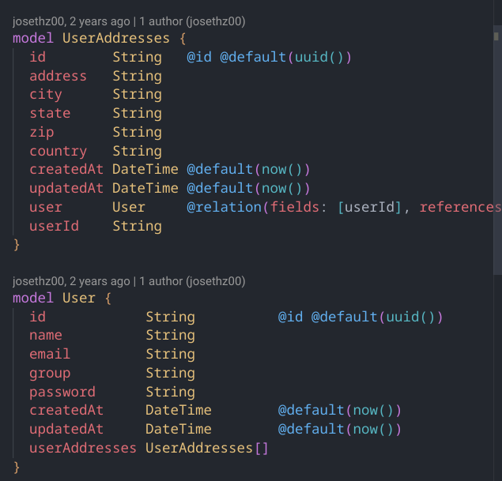

So sánh với TypeORM (Sequelize cũng giống giống vậy nên không đưa vào):

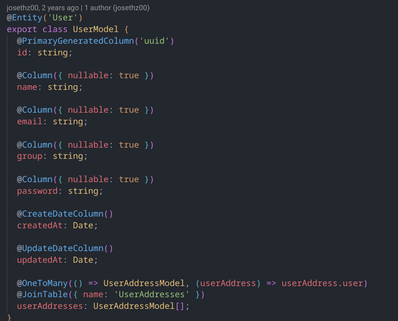

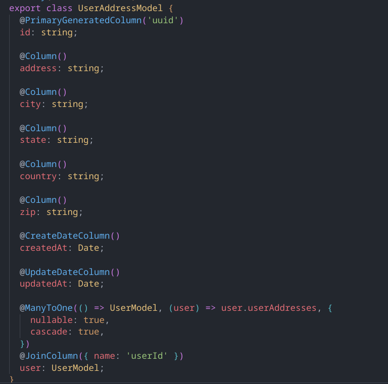

Có thể thấy là do dùng modeling language riêng nên prisma không cần động tới mớ decoration (là mớ @..) khó nhìn, và đúng là kiểu của prisma nhìn trực quan và đỡ rối mắt hơn thật
Tuy nhiên, việc dùng modeling language riêng thay vì dùng Typescript như TypeORM và Sequelize dẫn đến hệ quả sau:

- Tất cả các model đều gom chung vào 1 file schema.prisma duy nhất => với các project vừa và to trên 10 bảng, ví dụ 100 bảng thì ôi thôi nhìn như tờ sớ à, lúc debug thì thôi rồi.
- Vì câu query phải được convert từ langue modeling riêng của nó nên khi sync thực chất nó vẫn phải tốn thời gian chạy lệnh để convert từ file .prisma ra typescript (tất nhiên là lệnh này chỉ cần chạy một lần thôi bằng lệnh prisma generate nhằm sync giữa ORM và Database)
