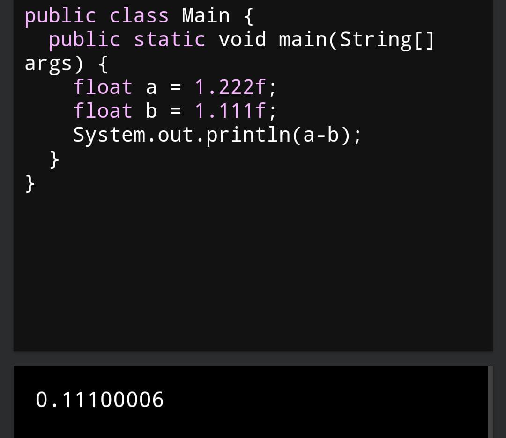
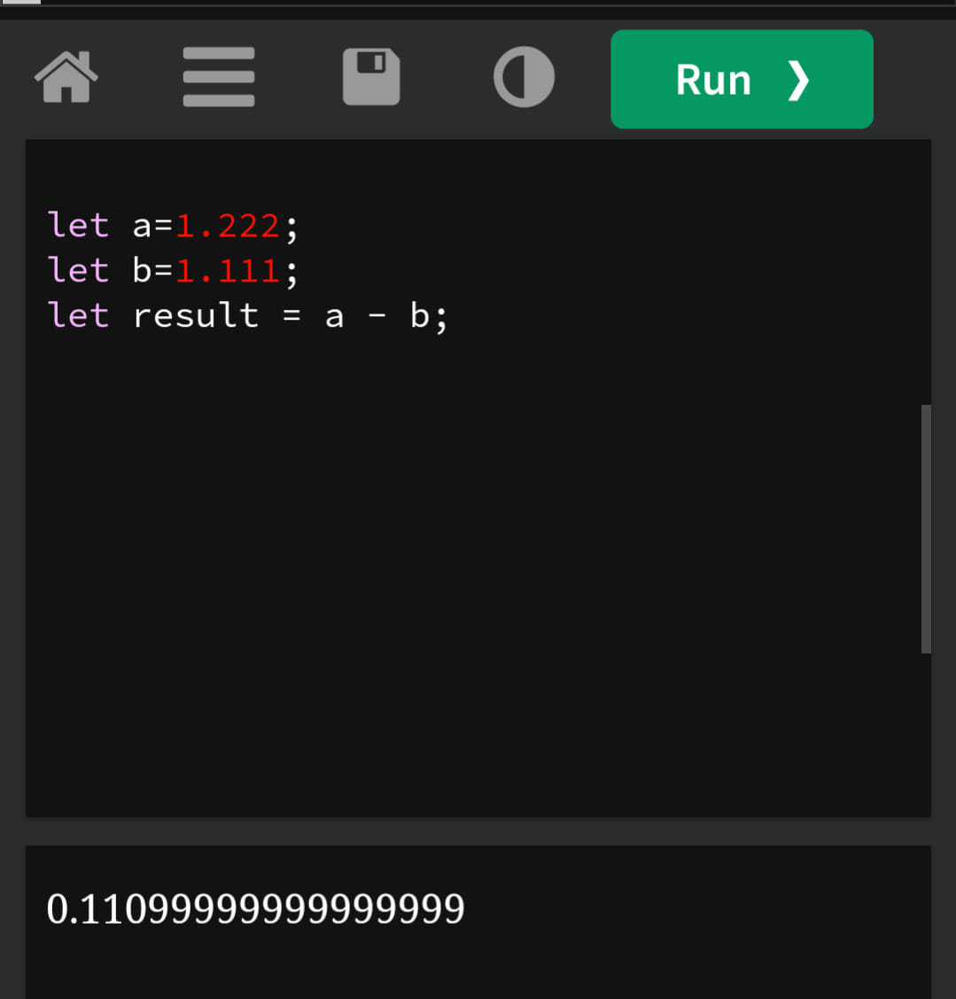
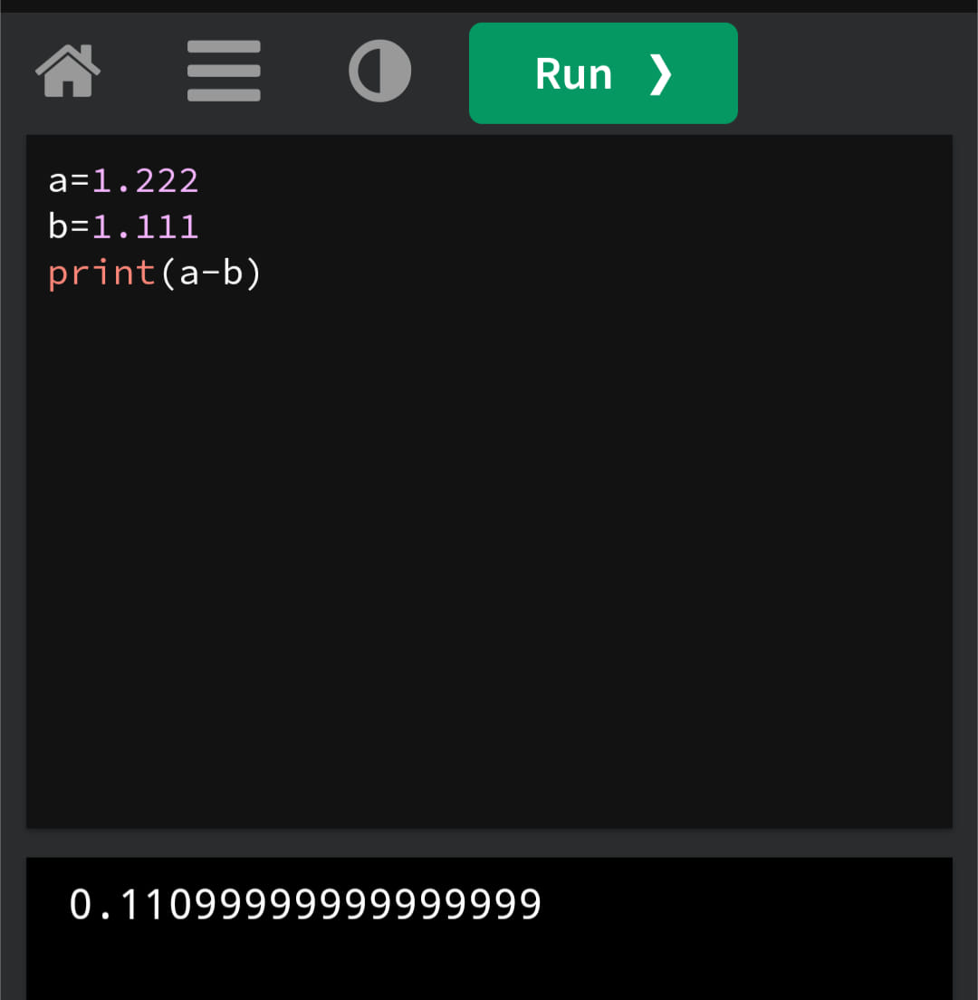
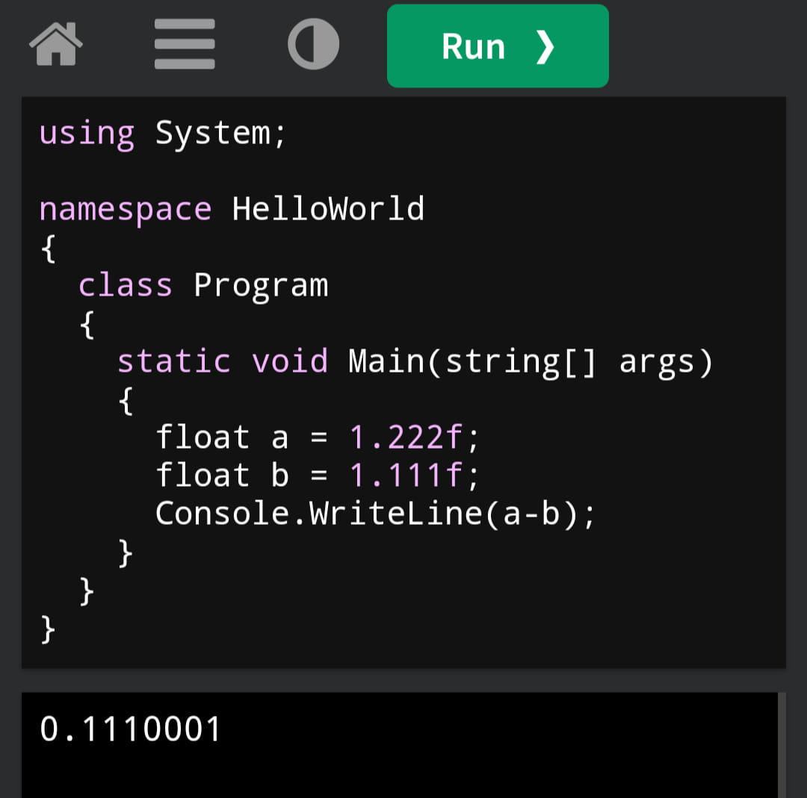
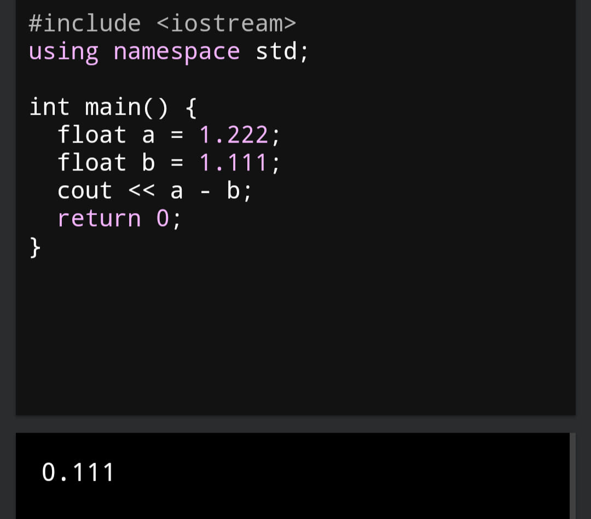

Vì sao 1.222 - 1.111 != 0.111 ?
Ngay bây giờ, bạn hãy thử mở IDE yêu thích của bạn ra, và code kiểm tra ngay đi, xem 1.222 - 1.111 được bao nhiêu.
Bất ngờ chưa, phép toán 1.222 - 1.111 mà đáng ra vozer cũng làm được thì đưa vào mỗi ngôn ngữ lập trình lại ra một đáp án SAI khác nhau, cụ thể với Javascript, Java, Python,... sẽ ra các đáp án khác kết quả đúng là 0.111
Vì sao lại như vậy?

Đây là Java, và nó không ra đúng kết quả như mong đợi:

Cũng như Java, thằng em của nó là JavaScript cũng y hệt, mà số lại ra khác Java luôn

Một đáp án khác từ Python...

C# gần đúng rồi nè

Quá đỉnh, đó là C++, và nó là đứa duy nhất không sai trong cả đám, đúng là anh cả có khác

Giải thích, đó là vì số dấu phẩy động floating point trước giờ luôn là vấn đề chung trong khoa học máy tính, chứ không riêng gì các ngôn ngữ kể trên. Lỗi này xảy ra do sai số của số dấu phẩy động (floating-point precision error) khi sử dụng chuẩn IEEE 754 (double-precision floating-point).
Để giải thích cụ thể lý do, có một trang rất hay nói về vấn đề này: https://floating-point-gui.de/basic
Nói sơ sơ, thì đó là vì bản chất ngôn ngữ lập trình đã làm tròn các số 1.222 và 1.111 ngay từ trước khi thực hiện phép tính rồi, và boom, số kết quả sau cùng sẽ có sai số. Vậy tại sao nó phải làm tròn các số 1.222 và 1.111? Vì số dấu phẩy động là số rất khó để thể hiện dưới số nhị phân, nên, quyết định làm tròn.
