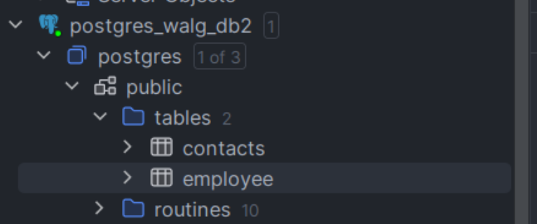

## 1. Wal-g là gì và tại sao lại dùng?


Wal-g là một công cụ để tạo các file backup cho PostgreSQL/MySQL/MariaDB/MS-SQL Server/MongoDB/Redis được compess và encrypt sau đó đây lên các storage bên thứ ba như AWS S3, GCS, Azure storage...

Vậy câu hỏi đặt ra là bản thân cơ sở dữ liệu đều có tính năng tạo file backup hết, ví dụ như PostgreSQL với tiện ích pgdump hay MySQL với tiện ích mysqldump. Vậy tại sao lại dùng thêm Wal-g làm gì?
Câu trả lời đó là vì sử dụng các tiện ích cung cấp sẵn, lấy ví dụ cụ thể ở đây là pgdump sẽ có nhiều hạn chế:

- Không có cron job để backup
- Chỉ có thể thực hiện full backup, tức là backup toàn bộ những gì có trong database vào thời điểm thực hiện backup, lấy ví dụ ngày 1/1 tôi backup database một lần, ngày 7/1 tôi lại backup lần nữa, như thế thì tôi có 2 file backup, và file backup sẽ có dữ liệu của file ngày 1/1, dẫn đến tiêu tốn tài nguyên disk do backup dư thừa cái đó có sẵn.
- Chỉ có thể tạo file backup lưu vào system, tức là lưu vào disk của server hiện đang chạy db đó, trong thực tế backup là để phòng trường hợp server sập, như thế thì file backup cũng mất luôn.
  Và còn nhiều lý do khác...

Vậy nên, dùng wal-g sẽ khắc phục các hạn chế trên:

- Wal-g tận dụng cơ chế WAL (Write Ahead Logging) của database, hiểu đơn giản Write-Ahead Logging là một cơ chế quan trọng trong cơ sở dữ liệu nói chung, khi hệ thống thực hiện thao tác như INSERT, UPDATE, DELETE, nó sẽ không ghi trực tiếp vào database, mà sẽ được ghi vào WAL giống như nhật kí, sau đó mới được ghi xuống database, dựa vào cơ chế này mà chúng ta có thể tạo ra các bản replication dựa trên nhật kí WAL này.
  => Nhờ đó, file backup sẽ không ghi đè lên dữ liệu của file cũ trước đó, mà chỉ lưu những thay đổi mới nhất tính từ thời điểm generate backup file.
- Wal-g có thể được setup để push các file backup lên trên các service bên thứ 3 như AWS S3, GCS, Azure Storage, hoặc qua SSH đến server khác,... Khắc phục trường hợp server host db sập thì file backup vẫn tòan vẹn bên service khác.
  ...

Độ uy tín: Repo của wal-g: https://github.com/wal-g/wal-g được 3,2k star


## 2. Setup wal-g với postgresql

- Cài thẳng vào máy bằng file:
  https://github.com/wal-g/wal-g/releases
- Dùng Dockerfile này để build wal-g image: https://github.com/chabuuuu/walg-postgres-example/blob/main/docker-image/wal-g/Dockerfile
  Ở bài viết này sẽ thực hiện setup wal-g trên môi trường docker. Từ repo sau: https://github.com/chabuuuu/walg-postgres-example.

Bối cảnh:

- Có 2 db, một db chính là postgres1, và một db phụ là postgres2
- Có một service tương tự AWS S3 chạy để lưu các file backup, ở đây sẽ sử dụng minIO: https://min.io/, là một tiện ích giúp lưu trữ các file object, y hệt như AWS S3, khác ở chỗ là sẽ chạy trên local.

Giải thích flow backup và restore:


Đầu tiên như hình, ta cần phải tạo một file base backup trước, base backup là một file tạo ra một bản sao lưu toàn bộ dữ liệu của PostgreSQL, bao gồm cả các file dữ liệu, cấu hình, và các file WAL (Write-Ahead Logging). => Trước khi tạo các file WAL luôn phải tạo một base backup toàn bộ dữ liệu trước


Tiếp đến:

1. PostgreSQL sẽ tự động tạo các file wal mỗi x time, x này có thể config được => wal-g sau đó sẽ đem file wal được tạo và push lên miniIO
2. miniIO save lại file wal được push lên, ở đây là file wal3, cũng là file wal mới nhất hiện tại
3. Tại Postgres2, nơi cũng được cài đặt wal-g, ta có thể chạy lệnh wal-g backup-fetch LATEST để lấy về dữ liệu backup mới nhất => vậy là combo các file trước wal3 như wal2, wal1 và tất nhiên là base backup sẽ đươc fetch về để restore
4. Postgres2 sẽ restore dựa trên cả 4 file này, tất nhiên rồi bởi vì chỉ mỗi file wal3 là chưa đủ, vì như đã giải thích ở phần I, file wal chỉ chứa các thay đổi tính từ lúc tạo file wal trước đó, cho nên ta cần một stream các file wal để có thể lấy ra được toàn bộ dữ liệu.
   Vậy tuân theo flow trên, ta sẽ thực hiện lần lượt như sau:
   Clone repo setup sẵn về:

```
git clone https://github.com/chabuuuu/walg-postgres-example
```

Chạy lệnh duy nhất này để build ra docker image của postgres được setup sẵn wal-g:

```
./scripts/build-postgres-with-wal-g-docker-image.sh
```

Chạy postgres1 và s3, khoan chạy postgres2 vì ta đang giả lập trường hợp postgres1 đóng vai trò là db đang chạy trên server chính, trong trường hợp db này sập ta mới thực hiện chạy postgres2 và mang backup từ postgres1 vào để tiếp tục sử dụng.

```
docker-compose up -d postgres1 s3
```

Chạy lệnh sau để insert data mẫu vào postgres1

```
./scripts/pg1/load-seed.sh
./scripts/pg1/insert-fixtures.sh
```


Sau đó ta thực hiện tạo một base backup:

```
./scripts/pg1/make-basebackup.sh
```


Vào localhost:9000 là UI của miniIO, ta đã thấy được file base backup đã xuât hiện

Thử insert tiếp 10 dòng dữ liệu

```
./scripts/pg1/insert-fixtures.sh
```


Lúc này đã lên 20 dòng

Bây giờ ta sẽ thực hiện chạy postgres2 lên và restore từ file backup trên miniIO:

```
./scripts/pg2/restore.sh
```

Chạy script trên sẽ tự động gọi postgres2 dậy và đồng thời restore backup mới nhất trên miniIO

Và đây là data trong postgres2, đúng 20 dòng:


Test các trường hợp khác:
– Thử thêm mới một bảng vào postgres1


kết quả sau khi chạy script restore cả hai db1 và db2 đều giống hệt nhau



– Thử tạo một database mới bên trong db1: loan_db và có một table là contract


Bên db1: table contract sẽ có 5 record như dưới


Sau khi chạy restore, bên phía db2 cũng sẽ có database loan_db


data trong bảng contract cũng được restore y hệt db1


Vậy là mặc định, script restore của wal-g như sau:

```
/wal-g backup-fetch $PGDATA LATEST
```

Thì script này sẽ restore lại toàn bộ data được backup, bao gồm toàn bộ của database và table có trong đó.

## 3. Các tính năng của Wal-g

Tìm hiểu các config của wal-g:
Toàn bộ config sẽ được khai báo trong enviroment như sau:


Giài thích:

- PGUSER: Tên người dùng mặc định để kết nối với PostgreSQL.
- PGPASSWORD: Mật khẩu cho người dùng PostgreSQL được chỉ định bởi PGUSER.
- POSTGRES_USER:Tên người dùng mặc định được tạo khi khởi tạo cơ sở dữ liệu PostgreSQL.
- POSTGRES_DB: Tên cơ sở dữ liệu mặc định được tạo khi khởi tạo PostgreSQL.
- POSTGRES_PASSWORD: Mật khẩu cho người dùng PostgreSQL được chỉ định bởi POSTGRES_USER.
  Các config bên trên là các config của một database postgres thông thường, phần dưới sẽ là các config liên quan đến backup:
- AWS_ACCESS_KEY_ID: Khóa truy cập AWS (Access Key ID) dùng để xác thực với dịch vụ S3.
- AWS_SECRET_ACCESS_KEY: Secret Access Key dùng để xác thực với dịch vụ S3.
- WALE_S3_PREFIX: Đường dẫn S3 nơi wal-g sẽ lưu trữ các bản sao lưu.
- AWS_ENDPOINT: Endpoint của dịch vụ S3, thường được sử dụng khi bạn sử dụng một dịch vụ S3 tương thích như MinIO.
- AWS_S3_FORCE_PATH_STYLE: Buộc sử dụng kiểu đường dẫn cho các bucket S3, thường cần thiết khi sử dụng các dịch vụ S3 tương thích.
- AWS_REGION: Vùng AWS nơi dịch vụ S3 được đặt.
- WALG_COMPRESSION_METHOD: Phương pháp compress file backup được sử dụng bởi wal-g để nén các bản sao lưu. Có các tùy chọn là lz4, lzma, zstd, brotli.
  Lz4 thì nhanh nhất, nhưng mà chênh lệch size sau khi compress thì thấp, lzma thì chậm hơn tí, nhưng tỉ lệ chênh lệch size sau nén cao hơn. Brotil và zstd thì cân bằng nhất, nên sẽ chọn brotil.
- ARCHIVE_MODE: Bật chế độ lưu trữ WAL (Write-Ahead Logging) trong PostgreSQL, cần thiết để sao lưu liên tục.
- ARCHIVE_TIMEOUT: Thời gian chờ (tính bằng giây) trước khi PostgreSQL tạo một file wal mới, ví dụ ARCHIVE_TIMEOUT = 60 thì là 60s tạo một file wal mới một lần.

Vậy ta sẽ đi phân tích một chút về script restore của wal-g, ở phần 2, ta đã sử dụng script:

```
/wal-g backup-fetch $PGDATA LATEST
```

Trong đó, LATEST nghĩa là lấy ra file backup mới nhất, ngoài ra, còn có các tùy chọn khác
$PGDATA chính là thư mục /var/lib/postgresql/data/, ta sẽ chỉ định thư mục nào làm nơi lưu các file wal sau khi đã được lấy về và extract ra.
Partial restore
Dùng để chỉ rõ ra sẽ restore database, hay chi tiết hơn là table nào của database nào.

```
/wal-g backup-fetch $PGDATA LATEST --restore-only=loan_db
```

Lệnh trên tức là chỉ restore database có tên loan_db thôi

```
/wal-g backup-fetch $PGDATA LATEST --restore-only=loan_db/contract
```

Lệnh trên sẽ chỉ restore table contract trong database có tên loan_db

Ví dụ:
Postgres1 có 2 database chat_db và loan_db


Trước hết tôi thử tạo bảng contract trong loan_db và insert vào 1 dòng:


Tiếp theo tôi phải thực hiện tạo base backup cho postgres1:

```
./scripts/pg1/make-basebackup.sh
```

Sau đó, thực hiện tạo bảng message trong chat_db:


Sau đó, ta thử insert 1 dòng nữa vào loan_db/contract:


Vậy ta đã thực hiện thay đổi trên cả 2 database:

- loan_db: thêm 1 record mới vào bảng contract
- chat_db: tạo table message
  Bây giờ hãy thử restore với tùy chọn chỉ restore loan_db:

  ```
  /wal-g backup-fetch $PGDATA LATEST --restore-only=loan_db/contract
  ```

  Kết quả trên postgres2:

- chat_db không có table message


- loan_db, bảng contract có thêm 1 dòng dữ liệu:


